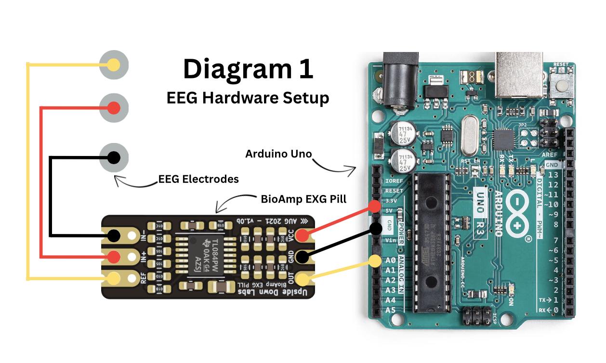
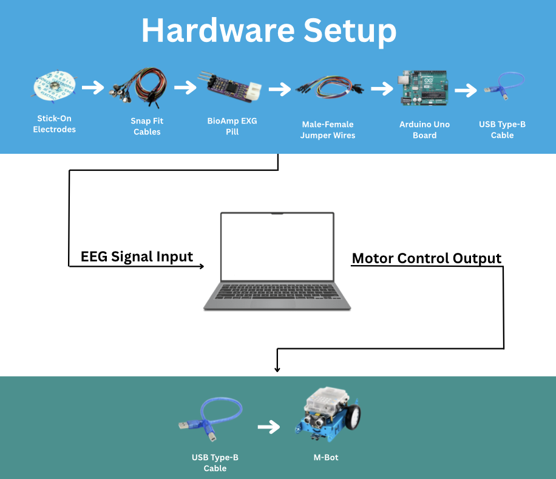

# Hardware Setup

### Materials
- [Gel Electrodes](https://www.amazon.com/Kendall-31050522-Covidian-Professional-Products/dp/B075YYZB9S/ref=sr_1_8?crid=LNL0806880OM&dib=eyJ2IjoiMSJ9.EoLXN-kCsN_HV-eltWagbC9C9362cj7qlOoUR0eKlZ5hUSgol8ClK9iMANuJYI54J2EfsNO2TPZUI_DmCtDuZkyIb3YN39IkCjN6aPGEsiSYMq6Xwf0oaApnK8ctYkjosVDU9QO79rOoBncKd_xvxh00iHGmwGMja_Mvta7NzU2MsxKmDSVx-3FyTzviSrhjQvivevN9G9n6zbOzihLldbg-P--h9eZV2XCPlxm6BEc.tyqVajth66K4ikjPk0ZPPk-wQk1T0Av5ClmhP8_3SH4&dib_tag=se&keywords=EEG+adhesive+electrodes+snap+fit&qid=1758864020&sprefix=ee+adhesive+electrodes+snap+fit%2Caps%2C184&sr=8-8) (3 per use)
- [3 Snap-fit Wires](https://store.upsidedownlabs.tech/product/different-color-snap-cables-pack-of-10/)
- [BioAmp EXG Pill](https://store.upsidedownlabs.tech/product/bioamp-exg-pill/) by Upside Down Labs
- 3 Male-Female Jumper Wires
- [Arduino Uno](https://store.arduino.cc/products/arduino-uno-rev3)
- 2 USB Type-B Cables

---

### Electronics Schematics

To set up the EEG system, start by connecting the electrodes to the snap-fit cables, and connect the free ends to the BioAmp EXG Pill. I used red, black, and yellow cables to represent IN+, IN-, and REF respectively.  

Next, connect the BioAmp EXG Pill to the Arduino Uno board using the male-female jumper wires. Connect the yellow wire from the output pin to the A0 Analog Input port on the Arduino; connect the black wire from the ground pin to the ground port on the Arduino; and connect the red wire from the VCC (power) pin to the 5V port.  

Here is the complete connection setup:

Now connect the USB cable from the Arduino board to your computer, so that the EEG signal can be processed.  

Connect the second USB cable from your computer to the M-Bot, in order to send the robot real-time motor commands based on the EEG input. Alternatively, you can connect to the M-Bot via Bluetooth.

---
### Hardware Setup Demonstration

EEG Setup Demo

<iframe width="800" height="450" 
    src="https://www.youtube.com/embed/GpGCMGngrpo?autoplay=1&mute=1" 
    title="EEG Setup Demo" frameborder="0" 
    allow="accelerometer; autoplay; clipboard-write; encrypted-media; gyroscope; picture-in-picture" 
    allowfullscreen>
</iframe>

 
M-Bot Build Demo

<iframe width="800" height="450" 
    src="https://www.youtube.com/embed/5uiRYBVInLg?autoplay=1&mute=1" 
    title="M-Bot Build Demo" frameborder="0" 
    allow="accelerometer; autoplay; clipboard-write; encrypted-media; gyroscope; picture-in-picture" 
    allowfullscreen>
</iframe>

