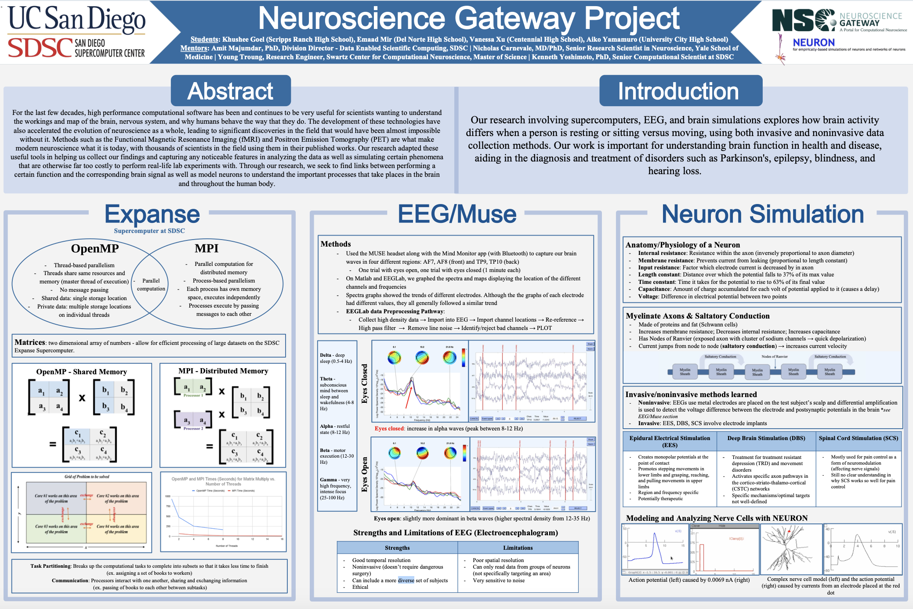

Welcome to the EEG Robot Control webpage. Here, I’ll cover how to control a M-Bot with EEG(electroencephalography) signals from start to finish. If you would like to follow along, check out the step-by-step YouTube tutorial or my GitHub repository.

<iframe width="800" height="450" 
    src="https://www.youtube.com/embed/uV7v0Md52Rs?autoplay=1&mute=1" 
    title="EEG Robot Control - A Complete Tutorial" frameborder="0" 
    allow="accelerometer; autoplay; clipboard-write; encrypted-media; gyroscope; picture-in-picture" 
    allowfullscreen>
</iframe>

### Inception 
This project started after I first began using a Muse EEG headband. The headset was designed for tracking sleep quality, but when used with third-party apps, I could use it to acquire raw EEG data in real time. Doing so, I saw my own brain waves being captured, and I became curious to learn more. 

My first EEG work was focused on analyzing biomarkers in the eyes-closed and eyes-open state, and through this I found that the brain exhibits fluctuations in alpha wave activity as we relax and close our eyes. 

This was my first step towards understanding EEG, but I still had yet to apply this technology towards something fascinating. 

That’s when I came across the Neuralink 2025 Summer Update. Whitenessing how brain chips are now being integrated with robotic arms to help disabled people draw, I had an idea of what I could integrate EEG with—robotics! Thus originated this project, a system which relies solely on EEG input to control the stop and go motor commands of an m-Bot.

### Mission Statement
As I worked on this project, my goal became to create a simplified BCI(Brain Computer Interface) with basic EEG equipment, so that more students can gain hands-on experience in this domain. Pivoting from the $300+ commercial EEG headband to this DIY setup which costs less than $50, I hope to make EEG and BCI related projects more affordable and accessible. 

If you have any questions or ideas on this project, feel free to reach out at goelkhushee@gmail.com. I would love to connect!

